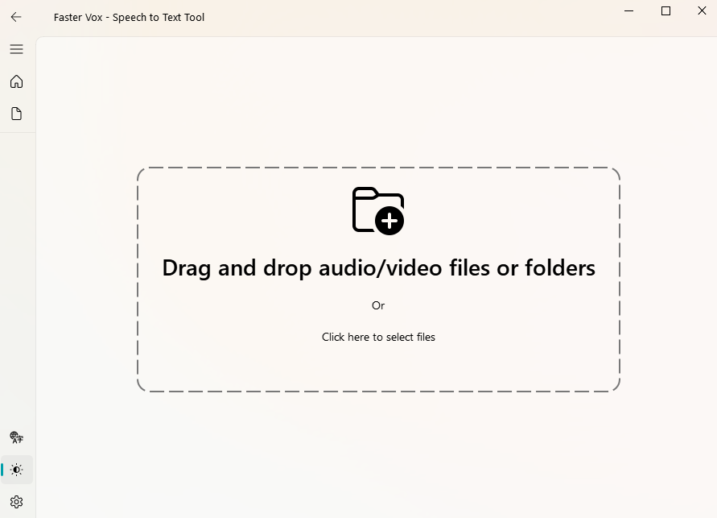

# Faster-Vox

[中文版](README.zh.md)



An efficient desktop speech transcription application based on Faster-Whisper and PySide6.

## Features

*   **One-click Transcription**: Easily convert video and audio content into editable text and subtitles using the Faster Whisper model.
*   **GPU Acceleration Support**: Automatically detects PC environment, defaults to CPU transcription, and can enable GPU acceleration on CUDA-enabled devices.
*   **Clean Interface, Simple Operation**: A concise and intuitive operating interface that supports light and dark theme switching.
*   **Multiple Output Options**: Supports word-level timestamps, and transcription results can be saved in common subtitle formats (SRT, VTT), plain text (TXT), and other popular formats.
*   **Interface Language**: Supports Chinese and English interface languages.
*   **Batch Processing**: Allows adding multiple audio files at once to queue transcription tasks.
*   **Real-time Monitoring**: Supports progress percentage display and transcription text preview, allowing real-time monitoring of current transcription progress.

## Running and Deployment

### Local Run

#### 1. Clone the Repository

```bash
git clone https://github.com/JorkeyLiu/faster-vox
cd faster-vox
```

#### 2. Create Conda Virtual Environment

If you use Conda, you can create a virtual environment with a specified Python version:

```bash
conda create -n faster-vox python=3.11.12
conda activate faster-vox
```

#### 3. Install Dependencies

```bash
pip install -r requirements.txt
```

#### 4. Run the Application

Execute the following command in the project root directory to start the Faster-Vox application:

```bash
python main.py
```

### Package as Executable (Optional)

You can use tools like PyInstaller to package Faster-Vox as a standalone executable for easy distribution and use.

```bash
pip install pyinstaller
pyinstaller FasterVox.spec
```

## License

This project is licensed under the MIT License. See the [LICENSE](LICENSE) file for details.

## Acknowledgements

This project uses the following excellent open-source libraries, and we express our gratitude:

*   [Faster-Whisper](https://github.com/guillaumekln/faster-whisper): A faster and more efficient implementation of the Whisper model based on CTranslate2.
*   [PySide6-Fluent-Widgets](https://github.com/zhiyiYo/PyQt-Fluent-Widgets): Provides Windows-style UI components.
*   [FFmpeg](https://ffmpeg.org/): Audio and video processing tool.