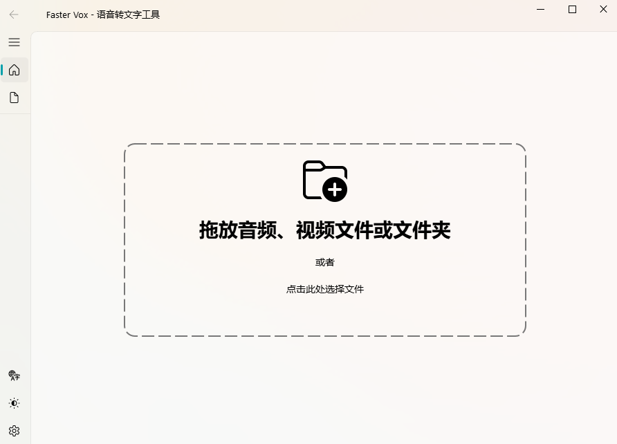

# Faster-Vox



一个基于 Faster-Whisper 和 PySide6 的高效桌面语音转录应用程序。

## 功能特性

*   **一键转录**：基于 Faster Whisper 模型，轻松将视频、音频格式内容转换成可编辑的文本、字幕。
*   **支持GPU 加速**：自动检测 PC 环境，默认使用 CPU 转录，可在支持 CUDA 的设备上开启 GPU 加速。
*   **清爽界面，操作简单**：简洁直观的操作界面，支持明暗主题切换。
*   **多种输出选择**：支持单词级时间戳，可以将转录结果保存为常用的字幕文件 (SRT, VTT)、纯文本 (TXT) 等常用格式。
*   **界面语言**：支持中文、英语两种界面语言。
*   **批量处理**：可以一次添加多个音频文件，排队完成转录任务。
*   **实时监控**：支持进度百分比显示与转录文本预览，可以实时监看当前转录进度。

## 运行和部署

### 本地运行

#### 1. 克隆仓库

```bash
git clone https://github.com/JorkeyLiu/faster-vox
cd faster-vox
```

#### 2. 创建 Conda 虚拟环境

如果您使用 Conda，可以创建一个指定 Python 版本的虚拟环境：

```bash
conda create -n faster-vox python=3.11.12
conda activate faster-vox
```

#### 3. 安装依赖

```bash
pip install -r requirements.txt
```

#### 4. 运行应用程序

在项目根目录下执行以下命令启动 Faster-Vox 应用程序：

```bash
python main.py
```

### 打包为可执行文件 (可选)

您可以使用 PyInstaller 等工具将 Faster-Vox 打包为独立的可执行文件，方便分发和使用。

```bash
pip install pyinstaller
pyinstaller FasterVox.spec
```

## 许可证

本项目使用 MIT 许可证。详情请参阅 [LICENSE](LICENSE) 文件。

## 致谢

本项目使用了以下优秀的开源库，在此表示感谢：

*   [Faster-Whisper](https://github.com/guillaumekln/faster-whisper): 基于 CTranslate2 的 Whisper 模型更快、更高效的实现。
*   [PySide6-Fluent-Widgets](https://github.com/zhiyiYo/PyQt-Fluent-Widgets): 提供了 Windows 风格的 UI 组件。
*   [FFmpeg](https://ffmpeg.org/): 音频和视频处理工具。